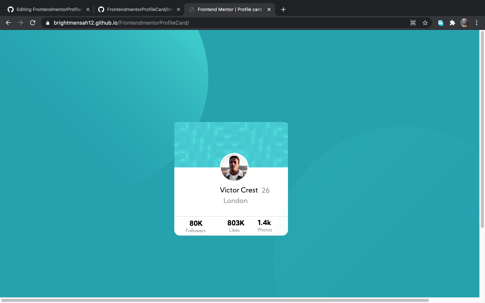

<!DOCTYPE html>

<body>
  <h1>Mobile</h1>
  
  
  <h1>Desktop</h1>
  
  </body>
  
  <h3>Links to solution</h3> 
  <a href="#">View solution</a>
  
  <h3> View Live Site </h3>
  <a href="https://brightmensah12.github.io/FrontendmentorProfileCard/">View solution</a>
  
  <h3>Built with</h3>
  
- Semantic HTML5 markup  
  - CSS custom properties

<h4>What I learnt</h4>

Using Emment to code faster  Emmet (previously known as Zen Coding) is a web-developer's toolkit that can greatly improve your HTML & CSS workflow you can type CSS-like expressions that can be dynamically parsed, and produce output depending on what you type in the abbreviation.  
you can check them here.
  <a href="https://docs.emmet.io/">Read about Emment</a>

Also using css (Cascading Style Sheets) to beautify your page or text  
example 

My name is Bright Mensah

style it with css to change the text to red like this
#name{
color:#FF0000;

  

</html>

